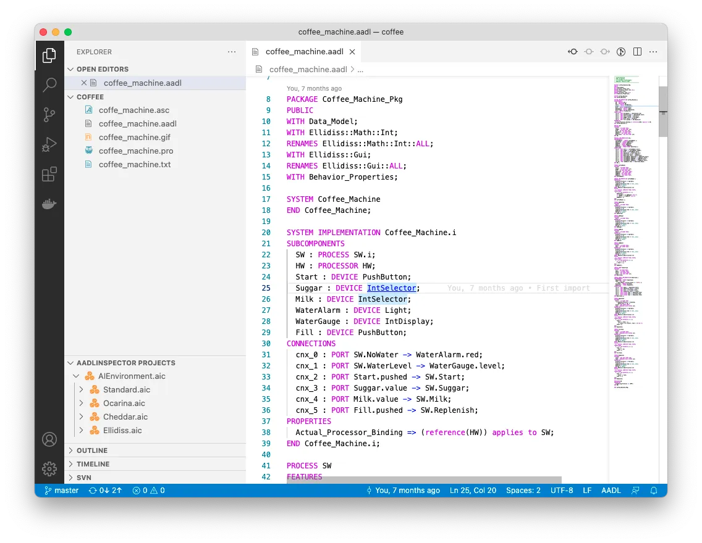

# AADL support for Visual Studio Code

<table>
<tr>
<td>
    

    This extension provides syntax highlight, error detection, multi file navigation and outlines for AADL files. It supports AADL 2.2 syntax.
    

    

    This extension is provided by <a href="https://www.ellidiss.com">Ellidiss Technologies</a>. For any question or problem,  contact us at <a href="mailto:support@ellidiss.com">support@ellidiss.com</a>.
    

</td>
<td>  </td>
</tr>
</table>

## Features

This extension contains a full AADL parser allowing error detection and reference resolution:

The reference resolution also allows for navigation between files:

A full list of symbols is availaible using `Ctrl+P #` or `Cmd+P #`:

A command named `Create Prolog statements from AADL source` will create Prolog statements for the current AADL document. These statements are compatible with [AADLInspector](https://www.ellidiss.com/products/aadl-inspector/#1602496553568-50349c49-b4ce1b55-4004).

## Extension Settings

This extension contributes the following settings:

* `aadl-ellidiss.maxDocumentSizeForParsing`: Maximum size for a document that can be parsed (in kilobytes). Default is 1024 kilobytes.

## Release Notes
## [0.2.0]

- Adds command to create Prolog statements from openned AADL document.
- Continue parsing with a missing semi-colon.
- Fix position for errors and navigation.

### 0.1.0

Initial release of `aadl-ellidiss`
