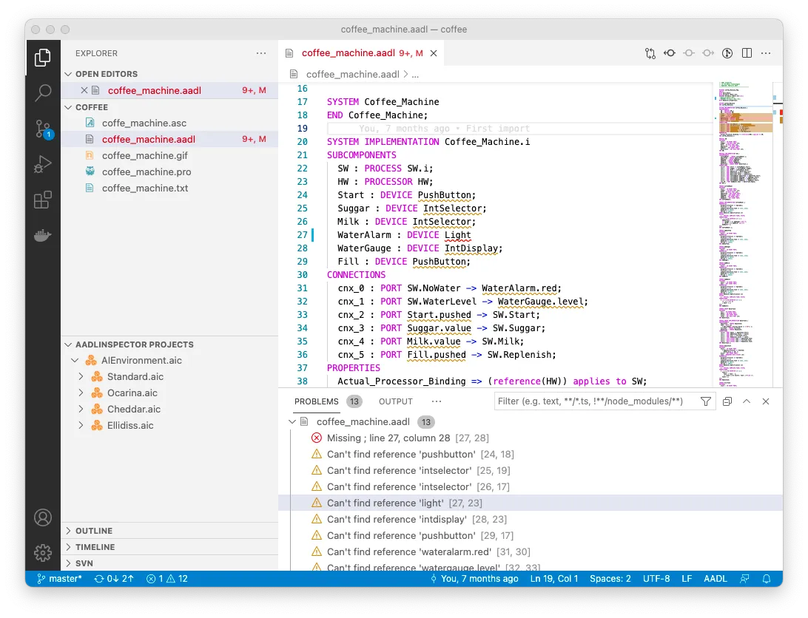

# AADL support for Visual Studio Code

<table>
<tr>
<td>
    

    Edit your AADL model with the Visual Studio Code AADL extension, and verify it with AADL Inspector.
    

    

    This extension adds full language support for AADL files into Visual Studio Code, including features such as syntax highlighting, outlines, error detection, reference navigation and renaming. It support the version 2.3 of AADL, i.e. complies with the <a href="https://www.sae.org/standards/content/as5506c">SAE AS-5506C</a> standard.
    

    

    This extension is provided free of charge by <a href="https://www.ellidiss.com">Ellidiss Technologies</a> and implements a seamless connection to the <a href="#AADL-Inspector-Integration">AADL Inspector</a> commercial tool.
    

    

    For any question, problem or new requirements, please contact us at <a href="mailto:support@ellidiss.com">support@ellidiss.com</a>.
</td>
<td>  </td>
</tr>
</table>

## Content

- [Features](#Features)
  - [Commands](#Commands)
- [AADL Inspector Integration](#AADL-Inspector-Integration)
  - [Commands](#Commands)
- [Extension Settings](#Extension-Settings)
- [Release Notes](#Release-Notes)
  - [1.1.1](#111)
  - [1.1.0](#110)
  - [1.0.1](#101)
  - [1.0.0](#100)
  - [0.9.0](#090)
  - [0.8.0](#080)
  - [0.7.0](#070)
  - [0.6.0](#060)
  - [0.5.0](#050)
  - [0.4.0](#040)
  - [0.3.0](#030)
  - [0.2.2](#022)
  - [0.2.1](#021)
  - [0.2.0](#020)
  - [0.1.0](#010)

## Features

This extension contains a full AADL parser allowing error detection. It detects syntax errors and missing or duplicate references and presents them. It parses and checks errors in all openned files and files in the current workspaces. The reference resolution works accros files and uses all parsed files including from AIC project (see [AADL Inspector Integration](#AADL-Inspector-Integration)).

When hovering a reference, if the referenced element contains documentation (comments preceding the declaration). It will be presented as an hover popup.

The resolved references by the parser are navigable in Visual Studio Code. Both by `Ctrl+Click` (or `Cmd+Click` on MacOS) to go to the definition or using *Go to References* or *Find all References*

A full list of symbols is availaible using `Ctrl+P #` or `Cmd+P #`:

This extension supports symbol renaming. By openning the contextual menu on a symbol and select `Rename Symbol` or by simply using `F2`, the extension will rename the symbol to the new name.

### Commands

A command named `AADL: Create Prolog facts from source` will create a Prolog facts base for the selected AADL file. This facts base is compatible with the LMP model processing technology that is used by [AADL Inspector](#AADLInspector-Integration).

The command `AADL: Split file into one file for each package (OSATE compabitility)` split openned file into one file for each package.

## AADL Inspector Integration

[AADL Inspector](https://www.ellidiss.com/products/aadl-inspector/) ([detailed](https://www.ellidiss.fr/public/wiki/inspector)) is a model processing framework for Critical Software Architecture Models. It embeds or connects to a set of analysis tools applying on AADL projects in the areas of real-time performance, safety and cyber-security.

This extension provides a bridger to AADL Inspector. It is able to show .aic AADL project files in a dedicated explorer, launch AADL Inspector on a given file or project and run analysis tools. To benefit at best this functions, it needs AADL Inspector to be installed and the corresponding path to be set in the extension settings.

For further information about how to get AADL Inspector , please contact us at [support@ellidiss.com](mailto:support@ellidiss.com). 

### Commands

The command `AADL: Launch AADL Inspector on current file and dependencies` will launch AADL Inspector on select AADL file or AIC project.

The command `AADL: Launch AADL Inspector plugin on current file and dependencies` will launch AADL Inspector and run a plugin on select AADL file or AIC project.

## Extension Settings

This extension contributes the following settings:

* `aadl-ellidiss.maxDocumentSizeForParsing`: Maximum size for a document that can be parsed (in kilobytes). Default is 512 kilobytes.
* `aadl-ellidiss.AADL InspectorPath`: Path to AADL Inspector installation on your system.
## Release Notes

### [1.1.1]

- Corrects properties in AADL 2.3 and updates documentation for hovers.
- Property metamodel references now supports `provided` and `requires`.
- If **AADLInspector Project** isn't already expanded, it's not expanded when openning a file referenced by an AIC file.

### [1.1.0]

- Updates parser to support AADL 2.3 (flow references can contains several indirections).
- Updates standard properties to support added properties in AADL 2.3.
- Present documentation hover for references.
- Fixed the stopping of the extension when a file pointed by an AIC didn't exist.

### [1.0.1] and [1.0.2]

- Updated documentation.
- Corrects AADL Inspector icon.

### [1.0.0]

- First public release
- Updated documentation

### [0.9.0]

- Adds a more robust reference resolution mecanism
- Presents duplication of element errors

### [0.8.0]

- Corrects parser error for range of with complex reference.
- Only load AIC file if present in a workspace.
- Reload units and AIC references upon configuration change.
- Better support for partial references resolution.
- Corrected error signalisation size.

### [0.7.0]

- Adds support for old AIC format.
- Reference resolution now support more cases (including multiple definitions).
- Adds support for partial reference resolution.
- Supports inverted feature groups.

### [0.6.0]

- Adds support for AADL Inspector environment files.
- Now listens to workspace folders changes and external document openings.
- Few LAMP parsing fixes.

### [0.5.0]

- Adds command to run AADL Inspector from an AADL or AIC file, with or without a plugin.
- Adds a tree view to present AIC projects in workspace

### [0.4.0]

- All AADL files present in the workspace are loaded upon activation of extension.
- Reference resolution is now incremental only updating current file and dependent units.
- Adds support for symbol rename.
- Shows all references for elements.

### [0.3.0]

- Corrects missing standard library preloading.
- Support for Behavior Annex syntax and reference checking.
- Better and more accurate reference resolution.

### [0.2.2]

- Corrects AADL commands on Windows failing with error `Command 'AADL: Create Prolog statements from source' resulted in an error`.

### [0.2.1]

- Supports corresponding embedded `{**` and `**}` tokens in annex
- Supports package splitting for OSATE compatibility with the Split command

### [0.2.0]

- Adds command to create Prolog statements from openned AADL document.
- Continue parsing with a missing semi-colon.
- Fix position for errors and navigation.

### [0.1.0]

Initial release of `aadl-ellidiss`
